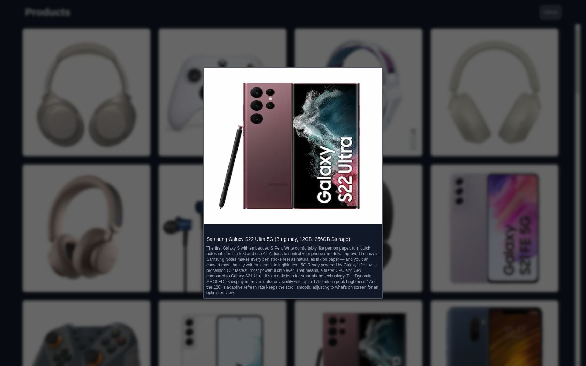

# Parallel Intercepting Routes with Next.js



Este projeto demonstra o uso de **Parallel Intercepting Routes** com Next.js para criar uma experiência de navegação dinâmica e eficiente. O projeto consome uma API de produtos e permite a visualização de detalhes de um produto em um modal. Quando a página é atualizada, apenas a página do produto é exibida.

## Features

- **Listagem de produtos:** exibe uma lista de produtos consumidos de uma API.
- **Modal de produto:** exibe detalhes do produto em um modal ao clicar em um item da lista.
- **Page Refresh:** ao atualizar a página, apenas a página de detalhes do produto é exibida, sem o modal.

## Tecnologias Utilizadas

- [Next.js](https://nextjs.org/)
- [React](https://react.dev/)
- [TailwindCss](https://tailwindcss.com/)

## Instalação

1. Clone o repositório:
   ```bash
   git clone https://github.com/manuelbento19/parallel-intercepting-routes.git
   ```

2. Navegue até o diretório do projeto:
   ```bash
   cd parallel-intercepting-routes
   ```

3. Instale as dependências:
   ```bash
   npm install
   ```

4. Inicie o servidor:
   ```bash
   npm run dev
   ```

   A app estará disponível em [http://localhost:3000](http://localhost:3000)


## Uso

1. **Listagem de produtos**
   - Navegue para a página inicial e você verá uma lista de produtos carregados da API.

2. **Visualizar detalhes do produto**
   - Clique em um produto da lista para abrir um modal com detalhes do produto.

3. **Atualização da página**
   - Se você atualizar a página enquanto o modal está aberto, você será redirecionado para a página de detalhes do produto, e o modal não será exibido.

## Contribuindo

Se você quiser contribuir para este projeto, sinta-se à vontade para enviar pull requests. Certifique-se de seguir as diretrizes de contribuição e de que as alterações não quebrem a funcionalidade existente.
